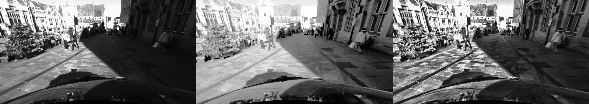

Detail approach to the problem and the success in the task specified.

Provide illustrative images of the intermediate results of the system (e.g. overlays), results of the processing stages.
Titles, captions, references and graphs do not count towards the total word count of the report.

Scene changes in terrain type, illumination conditions, clutter, and road markings.

Efficiency is less important than performance.

# Pre-processing

The main purpose of pre-processing is to remove photometric distortion. This can take many forms: specular surfaces,
foreshortening, perspective distortions, uniform / ambiguous regions, repetitive / ambiguous patterns, transparent objects,
occlusions and discontinuities. Of particular note in the provided dataset are specular surfaces 
(i.e. reflections off cars), transparent objects (e.g. windows).

The steps taken in pre-processing were based off [this study](https://ieeexplore.ieee.org/document/8284645),
namely the use of a median filter, Weiner filter, and histogram equalisation.

Typical operations include:
* Laplacian of Gaussian (LoG) filtering [here](https://www.ri.cmu.edu/publications/dehttps://docs.opencv.org/2.4/modules/imgproc/doc/histograms.html?highlight=equalizehist#equalizehistvelopment-of-a-video-rate-stereo-machine-2/)
* Subtraction of mean values computed in nearby pixels [here](https://www.researchgate.net/publication/228359300_Real_time_correlation-based_stereo_algorithm_implementations_and_application)
* Bilateral filtering [here](https://www-robotics.jpl.nasa.gov/publications/Adnan_Ansar/3dpvt.pdf)

## Histogram equalisation

The purpose of histogram equalisation is to increase the contrast of images. The images in the dataset
are ideal for equalisation - they have backgrounds and foregrounds that are both light and dark.

However, regular equalisation performs poorly when the image contains regions that are significantly lighter or darker 
than most of the image, as the contrast in those regions will not be sufficiently enhanced. 

Adaptive histogram equalisation (AHE) computes multiple histograms, each corresponding to a distinct section of the image,
and uses them to re-distribute the lightness values of an image. AHE is therefore suitable for local contrast and 
enhancing edge definition. It has a tendency to over-amplify noise in homogeneous regions, a shortcoming tackled
by contrast-limiting AHE (CLAHE) first introduced by [Zuiderveld (1994)](https://dl.acm.org/citation.cfm?id=180940).

### CLAHE vs "default"

The right image uses CLAHE. Details are a lot sharper, and details in the upper left-hand
region have been preserved, while the lower right-hand region has been simultaneously lightened.

CLAHE was found to be superior. Parameters were tweaked to compensate for the challenges of this dataset.

Following this, a range of CLAHE parameters were tweaked to improve results. 

AHE computes several histograms, each corresponding to a distcint section of the image,
and uses them to re-distribute the lightness values of the image.
It is therefore suitable for improving the local contrast and enhancing the definitions of edges 
in each region. Has a tendency of over-amplify noise in relatively
homogeneous regions of an image. CLAHE prevents this by limiting the amplification
by clipping the histogram at a pre-defined value.  

### Parameters

There are two parameters for CLAHE: 
* `tile_grid_size`, which defines the size of the tiles the input image will be divided into. Standard is `(8, 8)`. Minimum is `(2, 2)`.
Should be "larger than the size of the features to be preserved", according to [this site](https://imagej.net/Enhance_Local_Contrast_(CLAHE),
but the size of features is difficult to quantify.
* `clip_limit`, which defines the threshold for contrast limiting. Standard is `2.0`. Range is `[0, 256]`.
Values in the range `[3, 4]` are recommended [here](https://en.wikipedia.org/wiki/Adaptive_histogram_equalization#Contrast_Limited_AHE).

Some work has been done to automate the selection of parameters for CLAHE, [here](https://pdfs.semanticscholar.org/dc4d/eadb948bb4a1b06d4745f804a49d72f5b19e.pdf),
although it was deemed out-of-scope for this project. Parameters were therefore tweaked by hand.

[This repo](https://github.com/YuAo/Accelerated-CLAHE) took a novel approach: applying CLAHE only to the luminance
channel of a colour image, which prevents unwanted hue and saturation change. However, this was not found to improve results.

### Results
Some research has been performed into automating the selection of parameters for CLAHE, but was deemed out-of-scope for this
project; parameters were tweaked by hand, in reasonable ranges. 

A comparison of two histogram equalisation techniques is imaged below, using the selected parameters. 

The left-hand image is a `left` image from the dataset, converted to greyscale, and chosen for high contrast.
Objects in the shaded right-hand region are difficult to distinguish; details in the upper left-hand region are obscured by bright light.
The centre image is the 'default' histogram equalisation `cv2.equalizeHist`. The right image is CLAHE. CLAHE clearly
offers superior contrast enhancement.

# Dense stereo

Two dense stereo approaches were comapred. The first, Semi-Global Block Matching (SGBM), is...
The second, Weighted Least Squares (WLS) is....

Much research has been done into choosing optimal parameters for *StereoBM*

https://jayrambhia.com/blog/disparity-mpas

Poor contrast due to glare.

Clip limit lies between 0 and 256. Common values limit the resulting amplification to between 3 and 4.
Nah. They are bad values. We're not trying to make it look unrealistic, after all.

A tool was used to tune StereoBM, available [here](https://github.com/vmarquet/opencv-disparity-map-tuner)

`cv::filterSpeckles` can be integrated into `SGBM` by setting `speckleWindowSize` and `speckleRange`; this is done here
for conciseness. 

maxDisparity should be chosen based on your camera's setup.

Pre-processing is typically performed to reduce photometric variations between the images.

Weighted Least Squares (WLS) was chosen as the alternative dense stereo ranging method.
It was found to be far superior to the basic SGBM method.

# Sources
* https://www.ncbi.nlm.nih.gov/pubmed/28350382
* https://hal.archives-ouvertes.fr/hal-01609038/file/moving-object-detection.pdf
* http://openaccess.thecvf.com/content_ECCV_2018/papers/Peiliang_LI_Stereo_Vision-based_Semantic_ECCV_2018_paper.pdf
* https://ieeexplore.ieee.org/document/8284645
